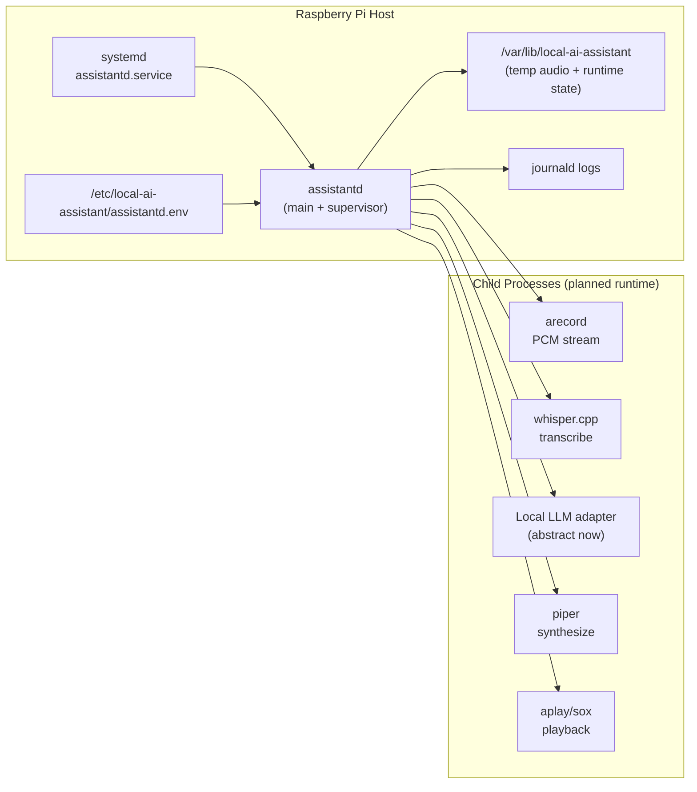
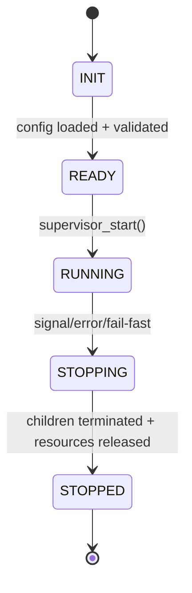
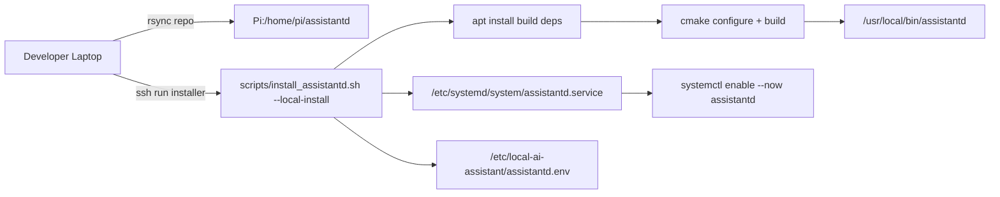

# HUMANS.md

## What This Repository Is
This repository contains the **human-facing guide** for working on `assistantd`, a local-only C daemon scaffold for Raspberry Pi voice interaction.

Current state is intentionally scaffold-first:
1. The project compiles.
2. The daemon has stable interfaces.
3. Runtime modules contain implementation-playbook TODOs.
4. End-to-end voice behavior is **not** fully implemented yet.

This is a deliberate design phase so architecture and contracts are solid before performance-sensitive implementation work begins.

## One-Screen Mental Model
`assistantd` is intended to become an always-listening local pipeline:
1. Capture PCM audio from microphone.
2. Detect speech start/end via VAD.
3. Transcribe utterance with STT.
4. Generate response with local LLM adapter.
5. Synthesize response with TTS.
6. Play output audio.

In this scaffold phase, those stages exist as module boundaries and status-driven stubs.

## Architecture Diagrams
### 1) System-level component map


### 2) Runtime data flow (single interaction)

```mermaid
flowchart LR
    Mic["Mic Input"] --> CapturePCM["audio_capture\nraw PCM frames"]
    CapturePCM --> Ring["ring_buffer\nSPSC queue"]
    Ring --> VAD["vad_detector\nspeech boundary events"]
    VAD --> Utterance["utterance assembler\nWAV artifact"]
    Utterance --> STT["stt_adapter\ntranscript text"]
    STT --> Prompt["single-turn prompt"]
    Prompt --> LLM["llm_adapter\nresponse text"]
    LLM --> TTS["tts_adapter\nreply WAV"]
    TTS --> Playback["playback\nspeaker output"]
```


### 3) Control/state flow


### 4) Deployment flow over SSH


## Important Constraints
- **Local-only mode is mandatory** right now.
- `ASSISTANT_MODE` must be `local`.
- Remote mode and automatic fallback are intentionally out of scope for this phase.
- Fail-fast behavior is preferred over silent fallback.

## Repository Map
- `CMakeLists.txt`: canonical build graph and test targets.
- `include/assistantd/`: public module interfaces.
- `src/assistantd/`: module implementations and TODO playbooks.
- `tests/c/`: shape/contract tests for scaffold behavior.
- `config/assistantd.env.example`: environment contract for daemon startup.
- `systemd/assistantd.service`: service unit scaffold.
- `scripts/install_assistantd.sh`: installation scaffold script.
- `docs/daemon-scaffold.md`: short status summary.
- `README.md`: concise project overview.
- `AGENTS.md`: agent-oriented execution rules.

## Build and Test Workflow
### Prerequisites
Install these tools on your machine:
1. C compiler with C17 support (`clang` or `gcc`).
2. CMake >= 3.20.
3. CTest (typically bundled with CMake).

### Configure
```bash
cmake -S . -B build -DCMAKE_BUILD_TYPE=Debug
```

### Build
```bash
cmake --build build
```

### Test
```bash
ctest --test-dir build --output-on-failure
```

### Run daemon scaffold
```bash
./build/assistantd --config ./config/assistantd.env.example --foreground
```

Expected current behavior:
- daemon initializes config and supervisor.
- supervisor hits TODO boundary (`ASSISTANTD_ERR_UNIMPLEMENTED`).
- process exits cleanly with scaffold log messages.

## Configuration Contract (Current)
Primary keys in `config/assistantd.env.example`:

| Key | Purpose | Current Requirement |
|---|---|---|
| `ASSISTANT_MODE` | runtime mode selector | must be `local` |
| `RUNTIME_DIR` | runtime artifacts and temp files | non-empty |
| `AUDIO_DEVICE` | capture/playback target | non-empty |
| `WHISPER_BIN` | STT executable path | non-empty |
| `WHISPER_MODEL_PATH` | STT model path | non-empty |
| `LLM_API_BASE_URL` | local LLM API base URL | non-empty |
| `LLM_MODEL` | LLM identifier | non-empty |
| `TTS_BIN` | TTS executable path | non-empty |
| `TTS_VOICE_PATH` | TTS voice model path | non-empty |
| `VAD_AGGRESSIVENESS` | VAD sensitivity | integer 0..3 |
| `VAD_SILENCE_MS` | speech-end silence threshold | integer 100..5000 |

Validation is enforced in `src/assistantd/config.c`.

## Service and Deployment Scaffolding
### systemd unit
`systemd/assistantd.service` is included as a scaffold and describes intended runtime wiring:
- environment file path
- executable path
- restart policy
- journal logging

### install script
`scripts/install_assistantd.sh` supports:
1. local installation on Pi (`--local-install`),
2. remote deployment over SSH from laptop (`--ssh user@host`).

It should evolve to:
1. install OS/runtime dependencies,
2. build `assistantd`,
3. install binary + config + unit,
4. reload and enable systemd service,
5. validate service health.

## Module-by-Module Status
### Config (`config.c/.h`)
- Has defaults, env parsing, and validation.
- Enforces local-only mode.
- Already useful for catching misconfiguration early.

### Ring buffer (`ring_buffer.c/.h`)
- Functional baseline implementation exists.
- Not lock-free production grade yet.
- TODOs define atomic/concurrency hardening work.

### Audio capture (`audio_capture.c/.h`)
- Interface exists.
- Process management behavior is TODO.

### VAD (`vad_detector.c/.h`)
- Interface/state placeholders exist.
- WebRTC VAD integration is TODO.

### STT (`stt_adapter.c/.h`)
- Adapter contract exists.
- Whisper process invocation/parsing is TODO.

### LLM (`llm_adapter.c/.h`)
- Abstract local adapter contract exists.
- Concrete transport/runtime implementation is TODO.

### TTS (`tts_adapter.c/.h`)
- Adapter contract exists.
- Piper integration is TODO.

### Playback (`playback.c/.h`)
- Interface exists.
- Playback subprocess execution and timeout policy are TODO.

### Supervisor (`supervisor.c/.h`)
- Lifecycle state machine exists.
- Full orchestration loop is TODO.

### Shutdown (`shutdown.c/.h`)
- Signal handler scaffold exists.
- Full shutdown choreography across workers/children is TODO.

## Tests: What They Mean
Current tests are intentionally **shape tests**, not full integration tests.

- `test_ring_buffer_shape.c`: verifies basic API behavior and data flow.
- `test_config_shape.c`: verifies config defaults/validation and local-mode enforcement.
- `test_supervisor_shape.c`: verifies scaffold lifecycle and explicit TODO boundary behavior.

These tests are guardrails for architecture stability while implementation fills in.

## CI: What It Enforces
CI currently checks:
1. CMake configure succeeds.
2. Build succeeds.
3. C tests run.
4. TODO playbook blocks exist in scaffold modules.

This keeps the scaffold discipline intact while implementation is still in progress.

## How To Implement From Here (Recommended Sequence)
Use this order to reduce churn and keep modules independently verifiable.

### Phase 1: Platform and lifecycle baseline
1. Finalize config semantics and runtime directory policy in `config.c`.
2. Remove compile warnings and portability issues (`main.c`, signal/time APIs).
3. Harden shutdown behavior and supervisor lifecycle transitions.
4. Add state-transition tests for `INIT -> READY -> RUNNING -> STOPPING -> STOPPED`.

### Phase 2: Audio ingestion and segmentation
1. Implement `audio_capture` process spawning (`arecord`) and controlled teardown.
2. Upgrade ring buffer to lock-safe/atomic SPSC behavior under sustained load.
3. Integrate WebRTC VAD in `vad_detector` with deterministic frame sizing.
4. Add utterance assembler that emits bounded WAV artifacts per speech segment.
5. Add tests for overflow, silence timeout, and noisy-frame boundary behavior.

### Phase 3: Model adapters and reply path
1. Implement `stt_adapter` subprocess contract and transcript extraction.
2. Implement `llm_adapter` concrete local transport behind current abstract interface.
3. Implement `tts_adapter` subprocess contract with timeout/error mapping.
4. Implement `playback` stage and device/busy-state handling.
5. Add per-stage integration tests with fixture/mocked subprocess behavior.

### Phase 4: Supervisor orchestration and fail-fast policy
1. Wire full per-interaction pipeline in `assistantd_supervisor_run_once`.
2. Enforce fail-fast semantics and structured status mapping across stages.
3. Add recovery policy for child process crashes (restart vs terminate).
4. Add end-to-end scenario tests for success, stage failure, and shutdown during work.

### Phase 5: Deployment hardening
1. Complete `install_assistantd.sh` package/runtime provisioning checks.
2. Add systemd hardening directives and validate service account ownership model.
3. Add health validation command(s) post-install and log collection guidance.
4. Validate full SSH deployment path on clean Pi image.

## Troubleshooting
### Build fails with missing CMake/CTest
Install CMake toolchain and rerun configure/build commands.

### Daemon exits quickly
Expected in scaffold phase when supervisor hits unimplemented pipeline path.

### Config validation error for mode
Set `ASSISTANT_MODE=local`.

### Service does not start
Confirm unit/config paths and executable location match deployment layout.

## Glossary
- **Scaffold**: compile-ready structure with stable interfaces and deliberate TODO boundaries.
- **Fail-fast**: immediate, explicit error return/logging instead of implicit fallback.
- **Shape test**: verifies API/lifecycle contract, not full production behavior.
- **Playbook TODO**: implementation contract embedded in code (inputs, outputs, errors, acceptance).

## Ownership Expectations
If you touch a module, update three things together:
1. the module interface/implementation,
2. the TODO playbook block,
3. at least one relevant test.

That keeps the codebase coherent while transitioning from scaffold to full runtime.
