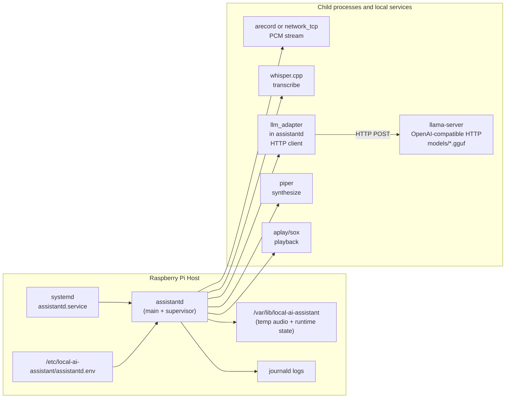
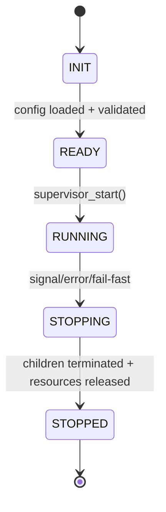
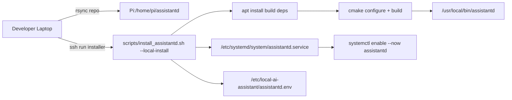

# HUMANS.md

## What This Repository Is
This repository contains the **human-facing guide** for working on `assistantd`, a local-only C daemon scaffold for Raspberry Pi voice interaction.

Current state is **scaffold-first with Phase 3 LLM progress**:
1. The project compiles.
2. The daemon has stable interfaces.
3. **LLM adapter** (`llm_adapter`): implemented — loads `LLM_SYSTEM_PROMPT_PATH`, POSTs OpenAI-style chat completions to `LLM_API_BASE_URL` with libcurl + cJSON, 40s timeout, optional shutdown abort via `assistantd_llm_set_shutdown_flag`. Vendored cJSON; CMake links libcurl.
4. **System prompt** for Baymax-style behavior lives in `config/system_prompt.txt`; production path is configured via `LLM_SYSTEM_PROMPT_PATH` in the env file.
5. **Local GGUF model** (e.g. SmolLM2-1.7B-Instruct Q4_K_M) is expected under `models/` (gitignored); run **llama-server** separately — it is not built by this repo.
6. **Audio capture** supports two modes: `arecord` (default) and development `network_tcp` on Pi loopback (`127.0.0.1`), intended for SSH-tunneled audio from a Mac.
7. End-to-end voice behavior (capture → VAD → STT → **supervisor-wired** LLM → TTS → playback) is **not** fully implemented yet; `DEV_PIPELINE_MODE=stt_only` can keep capture→VAD→STT running for dev transcript iteration.

This mix keeps contracts stable while the model adapter and prompt path are real for local testing against llama-server.

## One-Screen Mental Model
`assistantd` is intended to become an always-listening local pipeline:
1. Capture PCM audio from microphone (`arecord`) or from dev loopback TCP stream (`network_tcp`).
2. Detect speech start/end via VAD.
3. Transcribe utterance with STT.
4. Generate response with local LLM adapter.
5. Synthesize response with TTS.
6. Play output audio.

Capture/VAD/STT are now usable for local and dev-loopback iteration, while TTS/playback remain stubs; the LLM stage can talk to a running llama-server when `assistantd_llm_generate` is invoked with valid config.

## Architecture Diagrams
### 1) System-level component map


### 2) Runtime data flow (single interaction)

```mermaid
flowchart LR
    Mic["Mic Input"] --> CapturePCM["audio_capture\nraw PCM frames"]
    CapturePCM --> Ring["ring_buffer\nSPSC queue"]
    Ring --> VAD["vad_detector\nspeech boundary events"]
    VAD --> Utterance["utterance assembler\nWAV artifact"]
    Utterance --> STT["stt_adapter\ntranscript text"]
    STT --> Prompt["single-turn prompt"]
    Prompt --> LLM["llm_adapter\nresponse text"]
    LLM --> TTS["tts_adapter\nreply WAV"]
    TTS --> Playback["playback\nspeaker output"]
```


### 3) Control/state flow


### 4) Deployment flow over SSH


## Important Constraints
- **Local-only mode is mandatory** right now.
- `ASSISTANT_MODE` must be `local`.
- Remote mode and automatic fallback are intentionally out of scope for this phase.
- Fail-fast behavior is preferred over silent fallback.

## Repository Map
- `CMakeLists.txt`: canonical build graph, `find_package(CURL)`, vendored `src/third_party/cJSON/cJSON.c`, test targets.
- `include/assistantd/`: public module interfaces.
- `src/assistantd/`: module implementations and TODO playbooks.
- `src/third_party/cJSON/`: vendored cJSON (JSON for LLM request/response).
- `tests/c/`: shape/contract tests (`test_llm_adapter_shape.c` for LLM).
- `config/assistantd.env.example`: environment contract including `LLM_*` and `LLM_SYSTEM_PROMPT_PATH`.
- `config/system_prompt.txt`: default Baymax-style system prompt content (copy or symlink for deployment).
- `models/`: local GGUF weights (gitignored); e.g. `SmolLM2-1.7B-Instruct-Q4_K_M.gguf` — not committed.
- `docs/jack_log.txt`: contributor work log (optional).
- `systemd/assistantd.service`: service unit scaffold.
- `scripts/install_assistantd.sh`: installation scaffold script.
- `scripts/mac_stream_audio.sh`: macOS microphone sender for dev `network_tcp` capture mode.
- `docs/daemon-scaffold.md`: short status summary.
- `README.md`: concise project overview.
- `AGENTS.md`: agent-oriented execution rules and LLM commands.

## Build and Test Workflow
### Prerequisites
Install these tools on your machine:
1. C compiler with C17 support (`clang` or `gcc`).
2. CMake >= 3.20.
3. CTest (typically bundled with CMake).
4. **libcurl** development package so CMake can find CURL (e.g. Raspberry Pi OS: `libcurl4-openssl-dev`).
5. For local LLM inference tests: **llama.cpp** `llama-server` binary and a GGUF model under `models/` (see `AGENTS.md`).

### Configure
```bash
cmake -S . -B build -DCMAKE_BUILD_TYPE=Debug
```

### Build
```bash
cmake --build build
```

### Test
```bash
ctest --test-dir build --output-on-failure
```

### Run daemon scaffold
```bash
./build/assistantd --config ./config/assistantd.env.example --foreground
```

### Dev workflow: Mac microphone over SSH tunnel
1. On the Pi config file, set:
   - `AUDIO_INPUT_MODE=network_tcp`
   - `AUDIO_NETWORK_PORT=5555`
   - `DEV_PIPELINE_MODE=stt_only`
2. From the Mac, open tunnel to Pi loopback listener:
```bash
ssh -N -L 5555:127.0.0.1:5555 pi@<pi-host>
```
3. From the Mac, stream microphone PCM (`S16_LE`, mono, 16kHz):
```bash
scripts/mac_stream_audio.sh --host 127.0.0.1 --port 5555
```
4. On the Pi, run `assistantd` in foreground; transcripts will be logged continuously in `stt_only` mode.

Expected current behavior:
- daemon initializes config and supervisor.
- default mode (`DEV_PIPELINE_MODE=scaffold`) still hits TODO boundary (`ASSISTANTD_ERR_UNIMPLEMENTED`) after STT.
- development mode (`DEV_PIPELINE_MODE=stt_only`) continues capture -> VAD -> STT, skips LLM/TTS init, and logs transcripts continuously.
- LLM code paths are testable via `test_llm_adapter_shape` and manual runs against llama-server when env points at a readable prompt file and `LLM_API_BASE_URL` / `LLM_MODEL` match the server.

## Configuration Contract (Current)
Primary keys in `config/assistantd.env.example`:

| Key | Purpose | Current Requirement |
|---|---|---|
| `ASSISTANT_MODE` | runtime mode selector | must be `local` |
| `RUNTIME_DIR` | runtime artifacts and temp files | non-empty |
| `AUDIO_INPUT_MODE` | capture backend selector | `arecord` or `network_tcp` |
| `AUDIO_DEVICE` | capture/playback target | non-empty |
| `AUDIO_NETWORK_PORT` | loopback TCP port for `network_tcp` capture | integer 1..65535 (required for `network_tcp`) |
| `DEV_PIPELINE_MODE` | supervisor dev behavior gate | `scaffold` or `stt_only` |
| `WHISPER_BIN` | STT executable path | non-empty |
| `WHISPER_MODEL_PATH` | STT model path | non-empty |
| `LLM_API_BASE_URL` | local OpenAI-compatible API base (e.g. `http://127.0.0.1:8080/v1`) | non-empty in `scaffold` mode |
| `LLM_MODEL` | model id for chat completions (e.g. `SmolLM2-1.7B-Instruct-Q4_K_M`) | non-empty in `scaffold` mode |
| `LLM_SYSTEM_PROMPT_PATH` | filesystem path to system prompt text file | non-empty in `scaffold` mode |
| `TTS_BIN` | TTS executable path | non-empty in `scaffold` mode |
| `TTS_VOICE_PATH` | TTS voice model path | non-empty in `scaffold` mode |
| `VAD_AGGRESSIVENESS` | VAD sensitivity | integer 0..3 |
| `VAD_SILENCE_MS` | speech-end silence threshold | integer 100..5000 |

Validation is enforced in `src/assistantd/config.c`.

## Service and Deployment Scaffolding
### systemd unit
`systemd/assistantd.service` is included as a scaffold and describes intended runtime wiring:
- environment file path
- executable path
- restart policy
- journal logging

### install script
`scripts/install_assistantd.sh` supports:
1. local installation on Pi (`--local-install`),
2. remote deployment over SSH from laptop (`--ssh user@host`).

It should evolve to:
1. install OS/runtime dependencies,
2. build `assistantd`,
3. install binary + config + unit,
4. reload and enable systemd service,
5. validate service health.

## Module-by-Module Status
### Config (`config.c/.h`)
- Has defaults, env parsing, and validation.
- Enforces local-only mode.
- Already useful for catching misconfiguration early.

### Ring buffer (`ring_buffer.c/.h`)
- Functional baseline implementation exists.
- Not lock-free production grade yet.
- TODOs define atomic/concurrency hardening work.

### Audio capture (`audio_capture.c/.h`)
- `arecord` subprocess mode is implemented (non-blocking read + teardown).
- `network_tcp` dev mode is implemented: non-blocking loopback listener on Pi, single client, fixed 20ms frame assembly, disconnect/reconnect handling.

### VAD (`vad_detector.c/.h`)
- Implemented with `libfvad` frame classification and start/continue/end transitions.
- Tuning and environment-specific calibration remain TODO.

### STT (`stt_adapter.c/.h`)
- Whisper subprocess invocation and transcript parsing are implemented.
- Returns `ASSISTANTD_ERR_UNIMPLEMENTED` when whisper binary/model are unavailable.
- Timeout and broader integration-hardening remain TODO.

### LLM (`llm_adapter.c/.h`)
- **Implemented:** loads system prompt from `LLM_SYSTEM_PROMPT_PATH`; stores `LLM_API_BASE_URL` and `LLM_MODEL`; persistent libcurl handle; `generate()` POSTs JSON to `{base}/chat/completions`, parses `choices[0].message.content`; 40s timeout; optional shutdown via `assistantd_llm_set_shutdown_flag` + curl progress callback.
- **Not done:** supervisor pipeline does not yet pass STT transcript into `llm_generate` in a loop (Phase 4).
- **Runtime:** requires **llama-server** (or compatible server) with matching model; weights live in `models/` locally, not in git.

### TTS (`tts_adapter.c/.h`)
- Adapter contract exists.
- Piper integration is TODO.

### Playback (`playback.c/.h`)
- Interface exists.
- Playback subprocess execution and timeout policy are TODO.

### Supervisor (`supervisor.c/.h`)
- Lifecycle state machine exists.
- Default scaffold mode still returns TODO boundary after STT.
- `DEV_PIPELINE_MODE=stt_only` keeps capture->VAD->STT running and logs transcripts for dev iteration.

### Shutdown (`shutdown.c/.h`)
- Signal handler scaffold exists.
- Full shutdown choreography across workers/children is TODO.

## Tests: What They Mean
Current tests are intentionally **shape tests**, not full integration tests.

- `test_ring_buffer_shape.c`: verifies basic API behavior and data flow.
- `test_config_shape.c`: verifies config defaults/validation and local-mode enforcement.
- `test_audio_capture_shape.c`: verifies arecord scaffold behavior and network TCP frame/disconnect/reconnect behavior.
- `test_supervisor_shape.c`: verifies scaffold lifecycle plus `stt_only` run loop behavior.
- `test_llm_adapter_shape.c`: verifies LLM init (prompt file, curl), generate error paths, shutdown, shutdown-flag setter.

These tests are guardrails for architecture stability while implementation fills in.

## CI: What It Enforces
CI currently checks:
1. Ubuntu runner installs `libcurl4-openssl-dev` (for CMake `find_package(CURL)`).
2. CMake configure succeeds.
3. Build succeeds.
4. C tests run.
5. TODO playbook blocks exist in scaffold modules.

This keeps the scaffold discipline intact while implementation is still in progress.

## How To Implement From Here (Recommended Sequence)
Use this order to reduce churn and keep modules independently verifiable.

### Phase 1: Platform and lifecycle baseline
1. Finalize config semantics and runtime directory policy in `config.c`.
2. Remove compile warnings and portability issues (`main.c`, signal/time APIs).
3. Harden shutdown behavior and supervisor lifecycle transitions.
4. Add state-transition tests for `INIT -> READY -> RUNNING -> STOPPING -> STOPPED`.

### Phase 2: Audio ingestion and segmentation
1. Harden `audio_capture` backends (`arecord` + `network_tcp`) with richer diagnostics and long-run stability checks.
2. Upgrade ring buffer to lock-safe/atomic SPSC behavior under sustained load.
3. Integrate WebRTC VAD in `vad_detector` with deterministic frame sizing.
4. Add utterance assembler that emits bounded WAV artifacts per speech segment.
5. Add tests for overflow, silence timeout, and noisy-frame boundary behavior.

### Phase 3: Model adapters and reply path
1. Implement `stt_adapter` subprocess contract and transcript extraction.
2. **`llm_adapter`:** local HTTP transport to OpenAI-compatible server — **done** (libcurl + cJSON, system prompt file, timeout/shutdown). Remaining: optional integration tests with mocked server or fixture HTTP.
3. Implement `tts_adapter` subprocess contract with timeout/error mapping.
4. Implement `playback` stage and device/busy-state handling.
5. Add per-stage integration tests with fixture/mocked subprocess behavior.

### Phase 4: Supervisor orchestration and fail-fast policy
1. Wire full per-interaction pipeline in `assistantd_supervisor_run_once`.
2. Enforce fail-fast semantics and structured status mapping across stages.
3. Add recovery policy for child process crashes (restart vs terminate).
4. Add end-to-end scenario tests for success, stage failure, and shutdown during work.

### Phase 5: Deployment hardening
1. Complete `install_assistantd.sh` package/runtime provisioning checks.
2. Add systemd hardening directives and validate service account ownership model.
3. Add health validation command(s) post-install and log collection guidance.
4. Validate full SSH deployment path on clean Pi image.

## Troubleshooting
### Build fails with missing CMake/CTest
Install CMake toolchain and rerun configure/build commands.

### CMake fails: Could not find CURL
Install libcurl development headers. On Debian/Raspberry Pi OS: `sudo apt install libcurl4-openssl-dev`. On macOS, Xcode Command Line Tools usually provide CMake’s `FindCURL` target.

### LLM generate fails at runtime
Ensure **llama-server** is running with the same `LLM_API_BASE_URL` and `LLM_MODEL` as in your env file, and that `LLM_SYSTEM_PROMPT_PATH` points to a readable file. See `AGENTS.md` for example `llama-server` and `curl` commands.

### Daemon exits quickly
Expected in scaffold phase when supervisor hits unimplemented pipeline path.

### No transcripts in network TCP dev mode
Confirm all of these:
1. `AUDIO_INPUT_MODE=network_tcp` and `DEV_PIPELINE_MODE=stt_only`.
2. SSH tunnel is active: `ssh -N -L <port>:127.0.0.1:<port> pi@<pi-host>`.
3. `scripts/mac_stream_audio.sh` is running on Mac and targeting the tunneled port.

### Config validation error for mode
Set `ASSISTANT_MODE=local`.

### Service does not start
Confirm unit/config paths and executable location match deployment layout.

## Glossary
- **Scaffold**: compile-ready structure with stable interfaces and deliberate TODO boundaries.
- **Fail-fast**: immediate, explicit error return/logging instead of implicit fallback.
- **Shape test**: verifies API/lifecycle contract, not full production behavior.
- **Playbook TODO**: implementation contract embedded in code (inputs, outputs, errors, acceptance).

## Ownership Expectations
If you touch a module, update three things together:
1. the module interface/implementation,
2. the TODO playbook block,
3. at least one relevant test.

That keeps the codebase coherent while transitioning from scaffold to full runtime.
